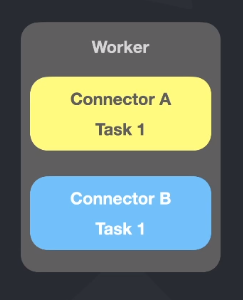
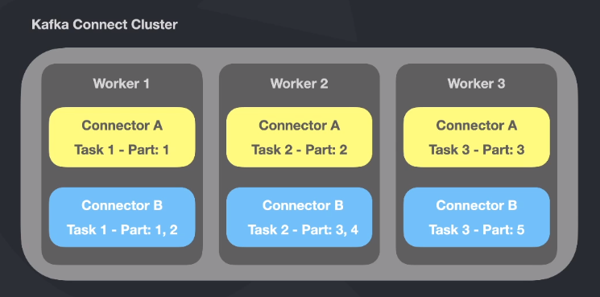

# full-cycle-2.0-kafka-connect

Files I produced during the Apache Kafka Connect classes of my [Microservices Full Cycle 2.0 course](https://drive.google.com/file/d/1MdN-qK_8Pfg6YI3TSfSa5_2-FHmqGxEP/view?usp=sharing).

# Theory

## Kafka Connect basic functioning

With Kafka Connect you can get data from one place, store it on a topic, and from the topic, store that data in another place. For example, get data from MySQL, store on a topic, and then, send that data to Elasticsearch.

## Standalone worker

Standalone workers have connectors inside them and inside the connectors there are tasks running to get data from one source and store it on another.

## Distributed Workers

With a cluster of distributed workers, you can divide the same task over multiple workers, each one reading from different partitions for example.

