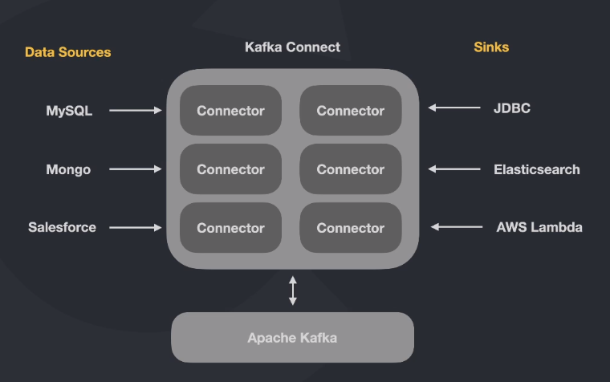

# full-cycle-2.0-kafka-connect

Files I produced during the Apache Kafka Connect classes of my [Microservices Full Cycle 2.0 course](https://drive.google.com/file/d/1MdN-qK_8Pfg6YI3TSfSa5_2-FHmqGxEP/view?usp=sharing).

# Theory

## Kafka Connect basic functioning

With Kafka Connect you can get data from one place, store it on a topic, and from the topic, store that data in another place. For example, get data from MySQL, store on a topic, and then, send that data to Elasticsearch.



## Standalone worker

Standalone workers have connectors inside them and inside the connectors there are tasks running to get data from one source and store it on another.


## Distributed Workers

With a cluster of distributed workers, you can divide the same task over multiple workers, each one reading from different partitions for example.


## Converters

Converters help you get data from one source, change it's format and send it to another source.


## Configuring a connector to import data from MySQL and export it to MongoDB

### Inserting data into MySQL

```sh
docker-compose up -d

# When the containers are ready, run:
docker-compose exec mysql bash

# Inside mysql container, run:
mysql -u root -p fullcycle  # Password is root
```

Inside MySQL shell, run:

```sql
create table categories(id int auto_increment primary key, name varchar(255));
show tables;
insert into categories (name) values ('Electronics');
select * from categories;
```

Now, go to Control Center (http://localhost:9021), Connect menu, upload mysql.properties and launch this connector.

Then you can go to the mysql-server.fullcycle.categories topic, in messages tab, and set the offset field to 0. You will see all messages in that topic. For now, the only one should be the insertion of the 'Electronics' category.

